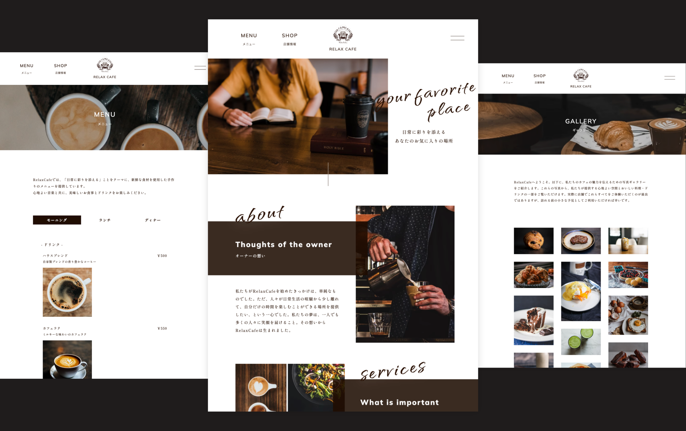

## シンプルな喫茶店の Web サイト



microCMS 公式のシンプルな喫茶店の Web サイトのテンプレートです。
フレームワークには Astro を使用しているため軽量な Web サイトになっています。

## 動作環境

Node.js 18 以上

## 環境変数の設定

ルート直下に`.env`ファイルを作成し、下記の情報を入力してください。

```
MICROCMS_API_KEY=xxxxxxxxxx
MICROCMS_SERVICE_DOMAIN=xxxxxxxxxx
SITE_URL=xxxxxxxxxx
FORM_URL=xxxxxxxxxx
GOOGLE_ANALYTICS_ID=xxxxxxxxxx
```

`MICROCMS_API_KEY`  
microCMS 管理画面の「サービス設定 > API キー」から確認することができます。

`MICROCMS_SERVICE_DOMAIN`  
microCMS 管理画面の URL（https://xxxxxxxx.microcms.io）の xxxxxxxx の部分です。

`SITE_URL`  
デプロイ先の URL です。プロトコルから記載してください。

例） https://xxxxxxxx.vercel.app/ など

`FORM_URL`  
お問い合わせの送信先です。
form タグの action に指定されます。
なお、プレビューでは [HyperForm](https://hyperform.jp/)を利用しています。

`GOOGLE_ANALYTICS_ID`  
GA4 を使った GoogleAnalytics の測定 ID です。
`@astrojs/partytown`が使用されているため、アナリティクスのために速度を犠牲にする必要はありません。

## 開発の仕方

1. パッケージのインストール

```bash
yarn
```

2. 開発環境の起動

```bash
yarn dev
```

3. 開発環境へのアクセス

[http://localhost:3000](http://localhost:3000)にアクセス

## Vercel へのデプロイ

[Vercel Platform](https://vercel.com/new)から簡単にデプロイが可能です。

リポジトリを紐付け、環境変数を `Environment Variables` に登録しましょう。
