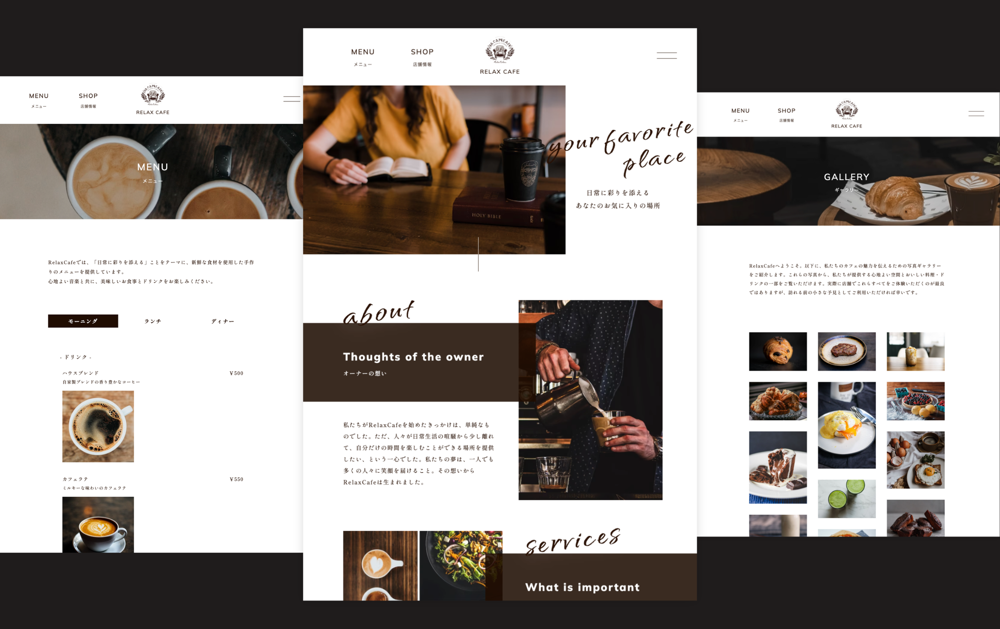
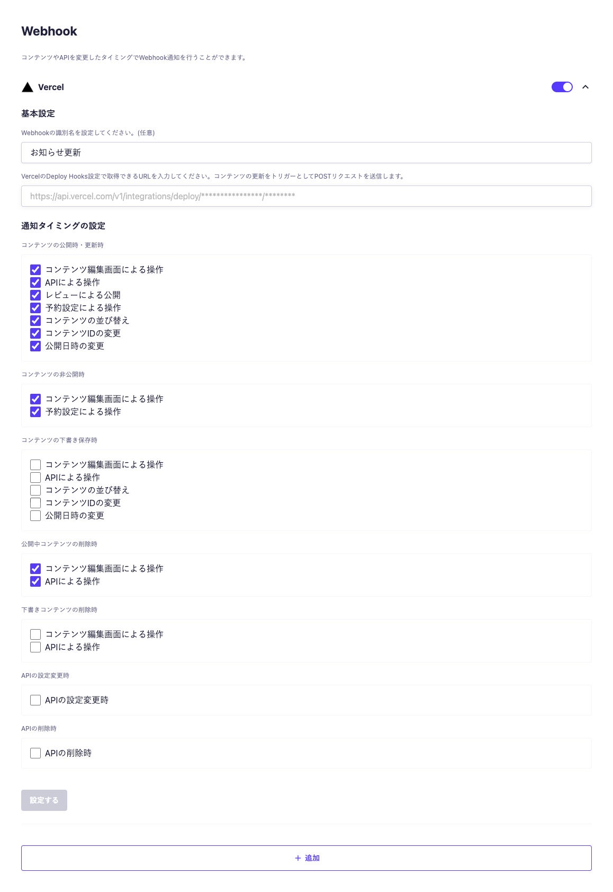

## シンプルな喫茶店の Web サイト



シンプルな喫茶店の Web サイトのテンプレートです。  
フレームワークには Astro を使用しているため軽量な Web サイトになっています。

## 動作環境

Node.js 18 以上

## 環境変数の設定

ルート直下に`.env`ファイルを作成し、下記の情報を入力してください。

```
PUBLIC_MICROCMS_API_KEY=xxxxxxxxxx
PUBLIC_MICROCMS_SERVICE_DOMAIN=xxxxxxxxxx
PUBLIC_SITE_URL=xxxxxxxxxx
PUBLIC_FORM_URL=xxxxxxxxxx
PUBLIC_GOOGLE_ANALYTICS_ID=xxxxxxxxxx
```

`PUBLIC_MICROCMS_API_KEY`  
microCMS 管理画面の「サービス設定 > API キー」から確認することができます。
なお、画面プレビューで microCMS へのリクエストをクライアントサイドから行う関係で、API キーは公開されます。  
そのため、API キーの権限については GET のみに設定してください。

`PUBLIC_MICROCMS_SERVICE_DOMAIN`  
microCMS 管理画面の URL（https://xxxxxxxx.microcms.io）の xxxxxxxx の部分です。

`PUBLIC_SITE_URL`  
デプロイ先の URL です。プロトコルから記載してください。

例） https://xxxxxxxx.vercel.app/ など

`PUBLIC_FORM_URL`  
お問い合わせの送信先です。  
form タグの action に指定されます。  
なお、プレビューでは [HyperForm](https://hyperform.jp/)を利用しています。

`PUBLIC_GOOGLE_ANALYTICS_ID`  
GA4 を使った GoogleAnalytics の測定 ID です。  
`@astrojs/partytown`が使用されているため、アナリティクスのために速度を犠牲にする必要はありません。

## 開発の仕方

1. パッケージのインストール

```bash
npm i
```

2. 開発環境の起動

```bash
npm run dev
```

3. 開発環境へのアクセス

[http://localhost:3000](http://localhost:3000)にアクセス

## Vercel へのデプロイ

[Vercel Platform](https://vercel.com/new)から簡単にデプロイが可能です。

リポジトリを紐付け、環境変数を `Environment Variables` に登録しましょう。

### webhook の設定

microCMS のコンテンツ更新があったタイミングで Vercel のデプロイをフックしましょう。
https://document.microcms.io/manual/webhook-setting#h065a574f0d

通知タイミングの設定は以下を参考にしてください。


「お知らせ」「メニュー」「ギャラリー」の API で同様に設定します。

## 画面プレビューの設定

このテンプレートでは「お知らせ」「メニュー」「ギャラリー」という microCMS の API が使用されています。  
これらすべて画面プレビューが利用可能です。  
そのためには microCMS の管理画面から URL の設定をする必要があります。  
https://document.microcms.io/manual/screen-preview

以下に画面プレビューの設定例を示しますのでドメイン部分を実際にデプロイする先に合わせて変更ください。

- お知らせ
  https://ドメイン/news/preview?contentId={CONTENT_ID}&draftKey={DRAFT_KEY}
- メニュー
  https://ドメイン/menu/preview?draftKey={DRAFT_KEY}
- ギャラリー
  https://ドメイン/gallery/preview?draftKey={DRAFT_KEY}
